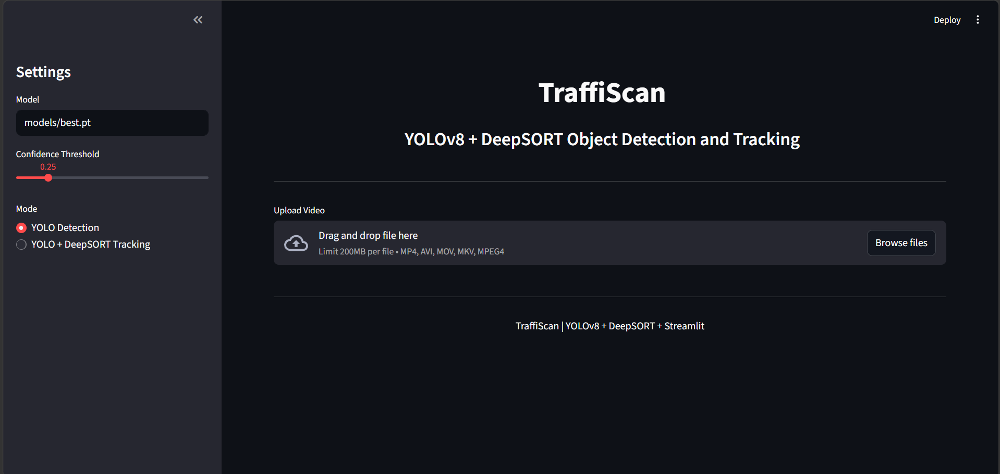
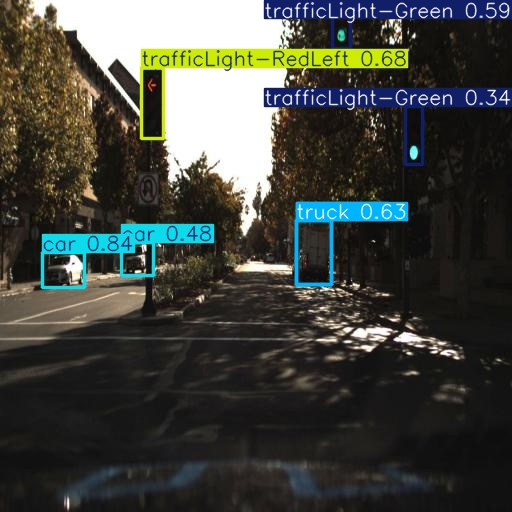
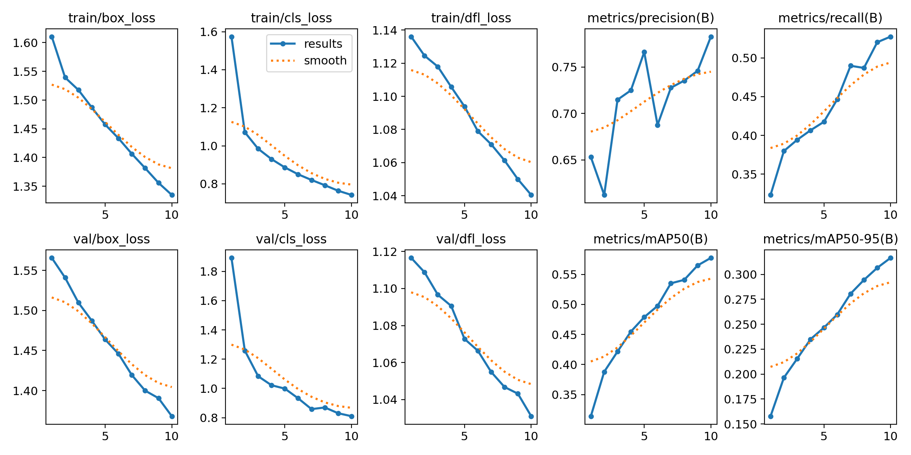
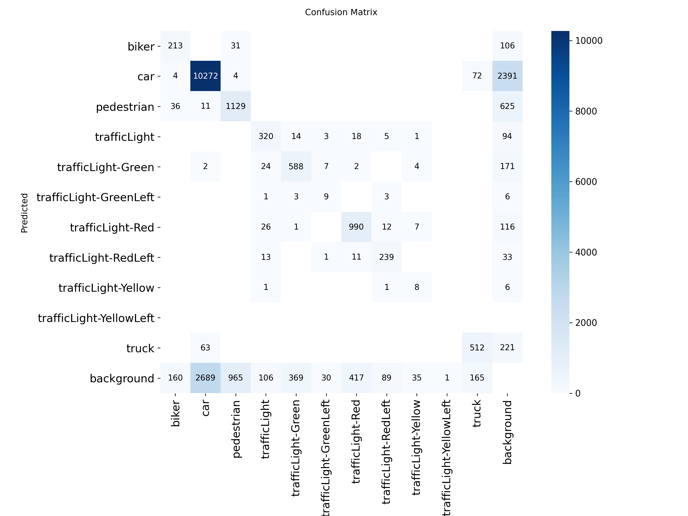
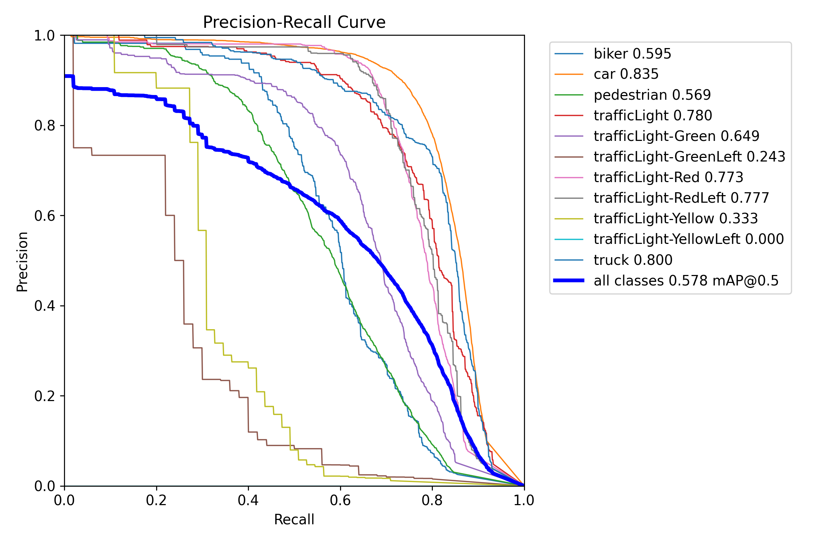
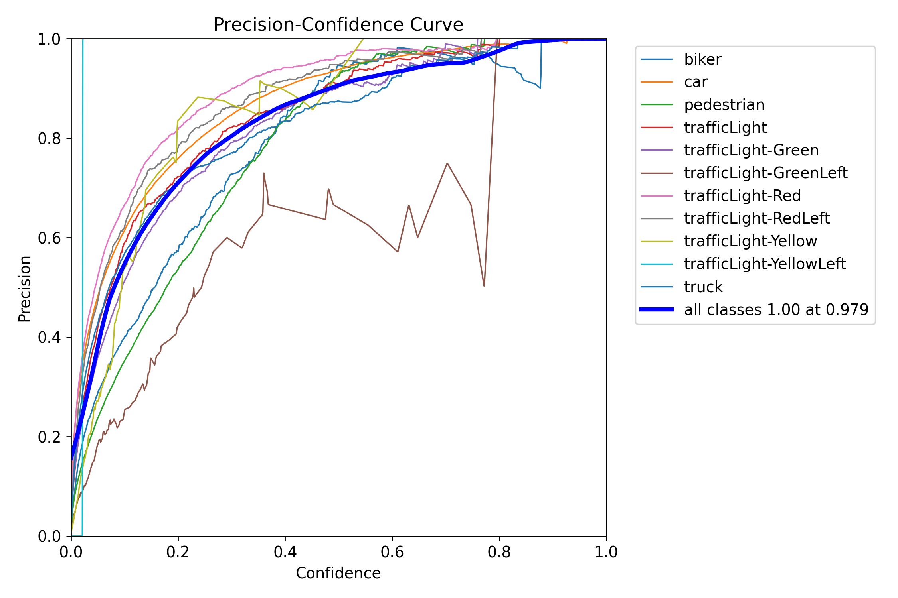
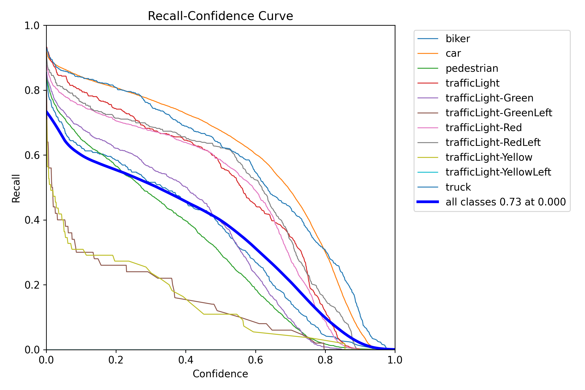
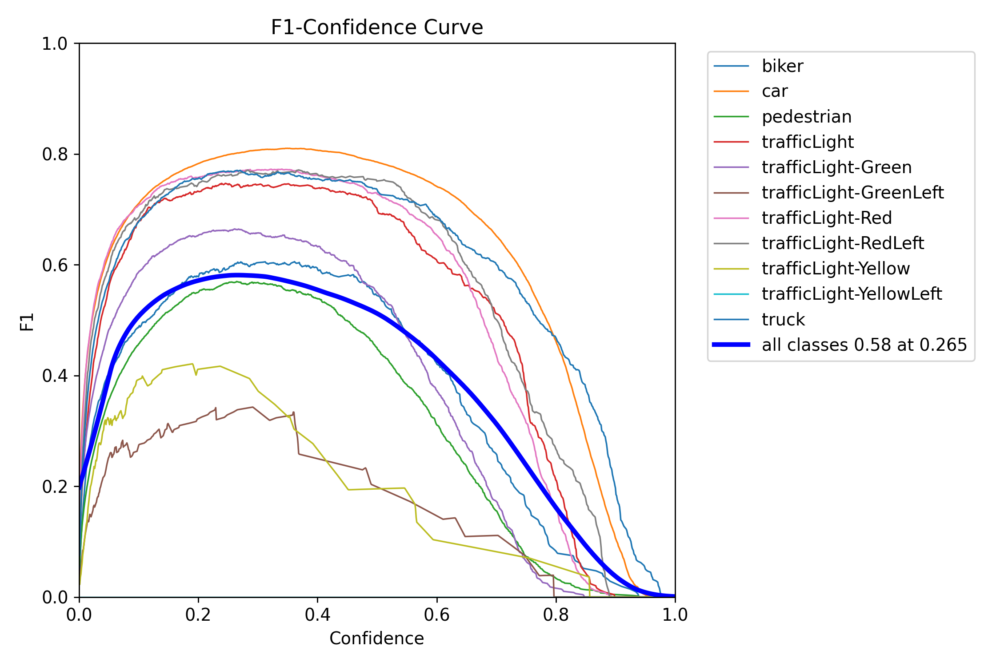
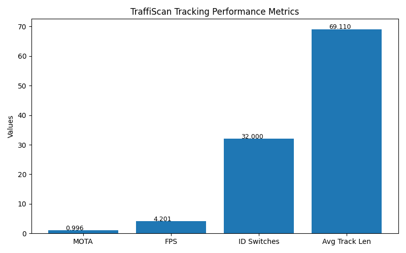

#  TraffiScan: Real-Time Object Detection and Tracking System

TraffiScan is a Computer Vision-based object detection and tracking system that combines **YOLOv8 object detection** and **DeepSORT multi-object tracking** to identify, track, and analyze vehicles in traffic videos. The system assigns persistent IDs to detected objects and visualizes tracking performance through an interactive Streamlit dashboard.

---

## Features

Vehicle Detection using YOLOv8

Multi-Object Tracking using DeepSORT

Streamlit-based Dashboard

Vehicle ID Assignment

Tracking Performance Evaluation


---

## Dashboard Preview

The Streamlit dashboard enables users to upload videos, perform object detection and tracking, visualize tracked objects, and monitor tracking performance metrics.



---

## Tech Stack

- Python
- OpenCV
- YOLOv8
- DeepSORT
- Streamlit
- NumPy
- Matplotlib

---

## System Pipeline

```text
Input Video
    ↓
YOLOv8 Detection
    ↓
DeepSORT Tracking
    ↓
Vehicle ID Assignment
    ↓
Trajectory Analysis
    ↓
Performance Metrics
```

---

## Detection Results

### Sample Detection



### Training Results



### Confusion Matrix



### Precision-Recall Curve



### Precision-Confidence Curve



### Recall-Confidence Curve



### F1-Confidence Curve



---

## Model Performance

The YOLOv8 model was trained on a multi-class traffic dataset containing vehicles, pedestrians, and traffic signal categories.

### Overall Performance

| Metric | Score |
|----------|----------|
| Precision | 0.78 |
| Recall | 0.53 |
| F1-Score | 0.58 |
| mAP@50 | 0.58 |

### Best Performing Classes

| Class | AP@50 |
|----------|----------|
| Car | 0.84 |
| Truck | 0.80 |
| Traffic Light | 0.78 |
| Traffic Light (Red Left) | 0.78 |
| Traffic Light (Red) | 0.77 |

---

## Tracking Performance



| Metric | Value |
|----------|----------|
| MOTA | 0.996 |
| FPS | 4.20 |
| ID Switches | 32 |
| Average Track Length | 69.11 |

The DeepSORT tracking pipeline successfully maintained object identities across frames and enabled trajectory-based analysis of moving vehicles in traffic scenarios.

---

## Demo Video

A sample traffic simulation video used for testing is available in:

```text
videos/cardrive.mp4
```

---

## Project Structure

```text
TraffiScan/
│
├── assets/
│   ├── dashboard.png
│   ├── detection/
│   │   ├── test.jpg
│   │   ├── results.png
│   │   ├── confusion_matrix.png
│   │   ├── BoxPR_curve.png
│   │   ├── BoxP_curve.png
│   │   ├── BoxR_curve.png
│   │   └── BoxF1_curve.png
│   │
│   └── airsim_track/
│       └── tracking_metrics_graph1.png
│
├── models/
│   └── best.pt
│
├── videos/
│   └── cardrive.mp4
│
├── app.py
├── airsim.py
├── training.ipynb
├── data.yaml
└── README.md
```

---

## Running the Project

### Clone Repository

```bash
git clone https://github.com/prachi2829/traffiscan.git
cd traffiscan
```

### Launch Dashboard

```bash
streamlit run app.py
```

---

## Future Enhancements

- Vehicle Counting
- Speed Estimation
- Lane-wise Analytics
- Traffic Congestion Analysis
- Real-Time Camera Support
- Cloud Deployment

---

## Author

**Prachi Yadav**

